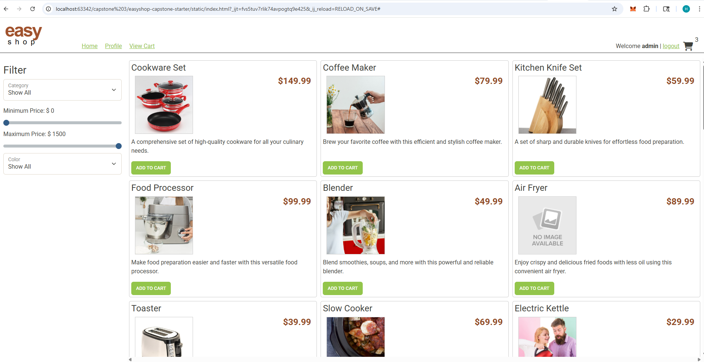
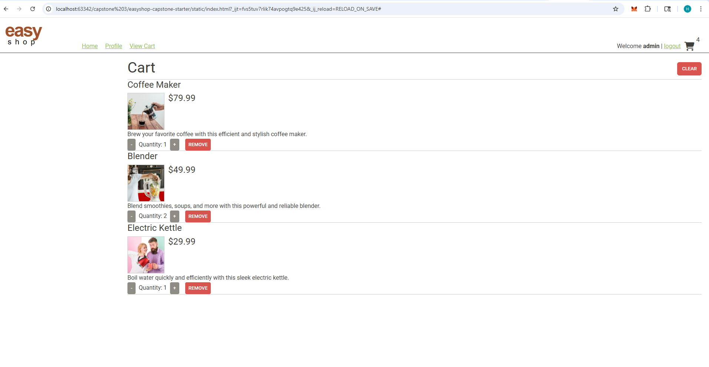
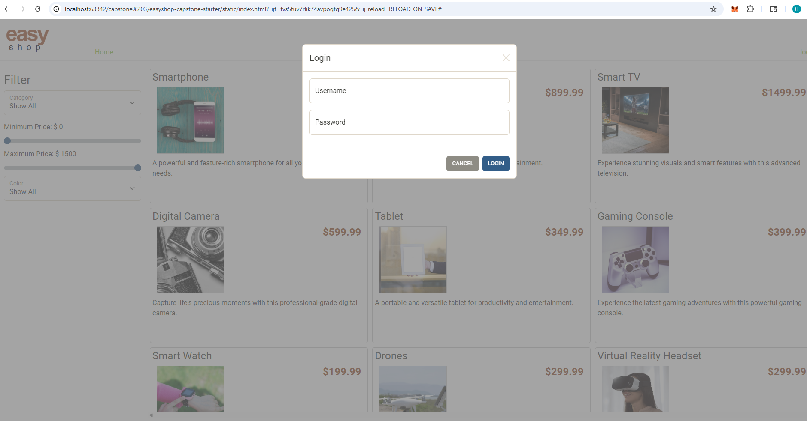

# EasyShop Capstone

A full-stack e‑commerce demo built with Spring Boot + MySQL and a lightweight static frontend (HTML/CSS/JS). Features product browsing, authentication with JWT, role-based admin actions, and a shopping cart.

---

## Table of Contents
- [Overview](#overview)
- [Features](#features)
- [Architecture](#architecture)
- [Tech Stack](#tech-stack)
- [Screenshots](#screenshots)
- [API Endpoints](#api-endpoints)
- [Authentication](#authentication)
- [Database](#database)
- [Frontend](#frontend)
- [Setup](#setup)
- [Running](#running)
- [Testing](#testing)
- [Interesting Code](#interesting-code)
- [Tools & Libraries](#tools--libraries)
- [Project Structure](#project-structure)
 - [Contributing](#contributing)
 - [Roadmap](#roadmap)
 - [Version & Changelog](#version--changelog)
 - [License](#license)
 - [Author](#author)
 - [Acknowledgments](#acknowledgments)
 - [Contact](#contact)

---

## Overview
EasyShop demonstrates a realistic micro-retail application:
- Secure login/register with JWT
- Public product browsing and category filters
- Role-based admin operations (create/update/delete products/categories)
- Authenticated shopping cart flow

Logo :


---

## Features
- **Product Catalog:** Search by category, price range, and subcategory.
- **Authentication:** Username/password login with JWT; register new users with roles.
- **Authorization:** `ROLE_USER` and `ROLE_ADMIN` guards via Spring Security.
- **Shopping Cart:** Add, update quantity, remove products, and clear cart.
- **REST API:** Clean controllers with validation and rich HTTP responses.
- **Static Frontend:** Bootstrap styling + Axios calls for a simple UX.

---

## Architecture
- **Backend:** Spring Boot 2.7 (Java 17), controllers → DAO → MySQL via JDBC.
- **Security:** Stateless JWT with custom filters and `@PreAuthorize` guards.
- **Data Access:** Simple DAO implementations using JDBC; rows mapped into models.
- **Frontend:** Static files served by Spring (HTML/CSS/JS) calling backend APIs.


---

## Tech Stack
- **Language:** Java 17
- **Frameworks:** Spring Boot, Spring Security, Spring Validation
- **Auth:** JWT (`io.jsonwebtoken` JJWT)
- **Database:** MySQL 8, JDBC (`spring-jdbc`)
- **Build:** Maven Wrapper
- **Frontend:** HTML5, CSS, Bootstrap, Axios, vanilla JS
- **Testing:** JUnit, Spring Boot Test, Spring Security Test
- **Dev Experience:** Spring Boot DevTools, Insomnia for API testing, VS Code

See [pom.xml](pom.xml) for full dependency list.

---

## Screenshots
User‑facing and API testing views:

- Home page:
  
  

- Cart page:
  
  

- Login:
  
  

- Register (Insomnia):
  
  


---

## API Endpoints
Public and protected routes (selected):

- Products
  - `GET /products` — search with optional `cat`, `minPrice`, `maxPrice`, `subCategory`
  - `GET /products/{id}` — get a product
  - `POST /products` — create (admin)
  - `PUT /products/{id}` — update (admin)
  - `DELETE /products/{id}` — delete (admin)

- Categories
  - `GET /categories` — list all
  - `GET /categories/{id}` — get by id
  - `GET /categories/{id}/products` — products in a category
  - `POST /categories` — create (admin)
  - `PUT /categories/{id}` — update (admin)
  - `DELETE /categories/{id}` — delete (admin)

- Shopping Cart (authenticated)
  - `GET /cart` — get current user's cart
  - `POST /cart/products/{productId}` — add product
  - `PUT /cart/products/{productId}` — update quantity
  - `DELETE /cart` — clear cart
  - `DELETE /cart/products/{productId}` — remove product

- Auth
  - `POST /login` — returns JWT + user in body
  - `POST /register` — creates user + profile

Controller sources:
- [ProductsController](src/main/java/org/yearup/controllers/ProductsController.java)
- [CategoriesController](src/main/java/org/yearup/controllers/CategoriesController.java)
- [ShoppingCartController](src/main/java/org/yearup/controllers/ShoppingCartController.java)
- [AuthenticationController](src/main/java/org/yearup/controllers/AuthenticationController.java)

---

## Authentication
- **Login:** `POST /login` with `{ "username": "...", "password": "..." }`.
- **JWT:** Token returned in body and `Authorization` header (`Bearer <token>`).
- **Roles:** `ROLE_USER` (default) and `ROLE_ADMIN`. Admin can manage products/categories.
- **Security Config:** See [WebSecurityConfig](src/main/java/org/yearup/security/WebSecurityConfig.java).

Insomnia example — updating a product (admin):
```
PUT http://localhost:8080/products/{id}
Authorization: Bearer <JWT>
Content-Type: application/json

{
  "name": "Updated Product Name",
  "price": 19.99,
  "categoryId": 2,
  "description": "Updated description",
  "subCategory": "accessories",
  "stock": 50,
  "featured": true,
  "imageUrl": "https://example.com/images/updated-product.jpg"
}
```

---

## Database
- **Schema & Seed:** Run [database/create_database_easyshop.sql](database/create_database_easyshop.sql).
- **Config:** Edit [src/main/resources/application.properties](src/main/resources/application.properties)
  - `datasource.url=jdbc:mysql://localhost:3306/easyshop`
  - `datasource.username=...`
  - `datasource.password=...`
  - `jwt.secret=...` (set your own secret!)
- DAO example: [MySqlProductDao](src/main/java/org/yearup/data/mysql/MySqlProductDao.java)

---

## Frontend
Static assets live under [src/main/resources/static](src/main/resources/static):
- HTML templates in [templates](src/main/resources/static/templates)
- Styles in [css](src/main/resources/static/css)
- JS services/utilities in [js](src/main/resources/static/js) (Axios included)

Entry files:
- [static/index.html](src/main/resources/static/index.html)
- [static/js/application.js](src/main/resources/static/js/application.js)
- [static/js/services](src/main/resources/static/js/services)

---

## Setup
1. Install **MySQL 8** and create DB using the SQL script.
2. Update application settings in [application.properties](src/main/resources/application.properties).
3. Ensure Java 17 is available (`java -version`).

---

## Running
On Windows PowerShell:

```powershell
# from project root
.\mvnw.cmd clean install
.\mvnw.cmd spring-boot:run
```

Then open `http://localhost:8080`.

---

## Testing
Run unit/integration tests:

```powershell
.\mvnw.cmd test
```

Test resources live in [src/test/resources](src/test/resources), including [test-data.sql](src/test/resources/test-data.sql).

---

## Interesting Code
A concise query builder that supports optional filters for category, price range, and subcategory:

```java
// src/main/java/org/yearup/data/mysql/MySqlProductDao.java
public List<Product> search(Integer categoryId, BigDecimal minPrice, BigDecimal maxPrice, String subCategory) {
    String sql = "SELECT * FROM products " +
        "WHERE (category_id = ? OR ? = -1) " +
        "  AND (price >= ? OR ? = -1) " +
        "  AND (price <= ? OR ? = -1) " +
        "  AND (LOWER(subcategory) = LOWER(?) OR ? = '') ";
    
}
```

Why it’s neat:
- Keeps a single prepared statement while allowing any combination of filters.
- Avoids dynamic SQL string building; relies on sentinel defaults.

---

## Tools & Libraries
- **Spring Boot** (Web, Security, Validation)
- **JWT (JJWT)** for stateless auth
- **Spring JDBC** for database access
- **MySQL Connector/J**, **Commons DBCP2** for pooling
- **Maven Wrapper** for builds
- **Bootstrap**, **Axios**, **Vanilla JS** on the frontend
- **Spring Boot DevTools** for faster local iteration
- **JUnit + Spring Test** for tests
- **Insomnia** for endpoint verification
- **VS Code** as the primary editor

---

## Project Structure
```
.
├── mvnw / mvnw.cmd
├── pom.xml
├── database/
│   └── create_database_easyshop.sql
├── src/
│   ├── main/
│   │   ├── java/org/yearup/... (controllers, security, dao, models)
│   │   └── resources/
│   │       ├── application.properties
│   │       └── static/ (index.html, css, js, images, templates)
│   └── test/
│       ├── java/org/yearup/... (tests)
│       └── resources/ (test-data.sql)
└── screenshots/
    ├── home.png
    ├── cart.png
    ├── login.png
    ├── register new user on insomina.png
    └── update product on insomnia.png
```

---


## Contributing
- Pull requests are welcome. For major changes, please open an issue first to discuss what you’d like to change.
- Keep changes focused and follow existing style. Add tests where practical.

---

## Roadmap
- Add product reviews and ratings
- Pagination and sorting for catalog
- Admin dashboard UI improvements
- Docker compose for local DB + app

---

## Version & Changelog
- Current version: 0.0.1-SNAPSHOT (see [pom.xml](pom.xml))
- Changelog: track changes via commits; consider adding release notes.


---

## Author
- Henok 
- YearUp Capstone Project

---

## Acknowledgments
- YearUp curriculum and guidance
- Pluralsight resources for Java/Spring
- Spring Boot and open-source community

---

## Contact
- Email: henoksmekuria@gmail.com
- Issues and feature requests: open an issue in this repository

---


