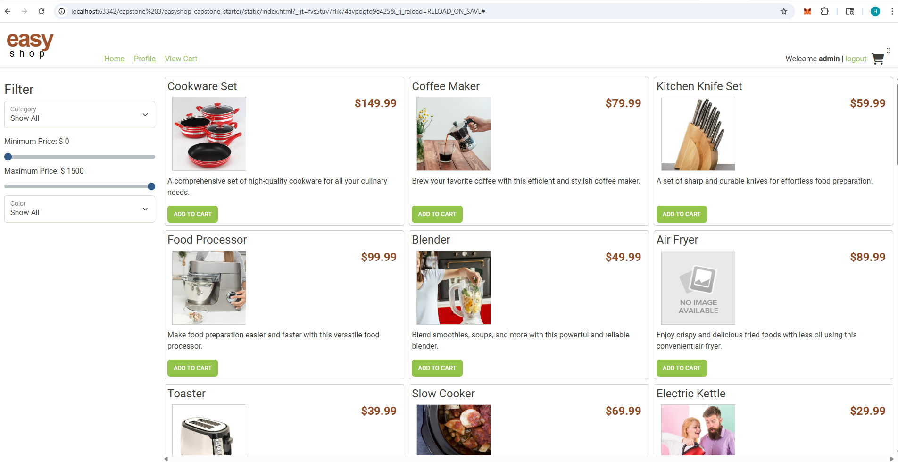
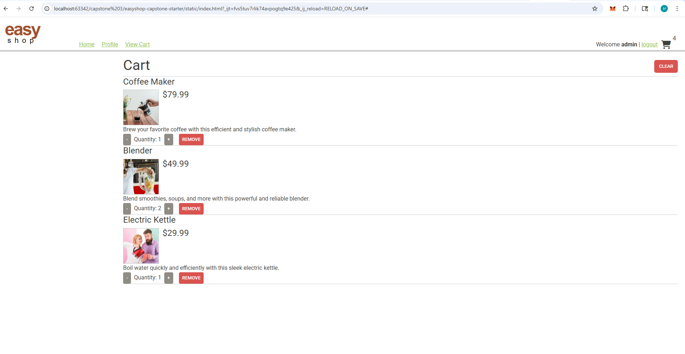
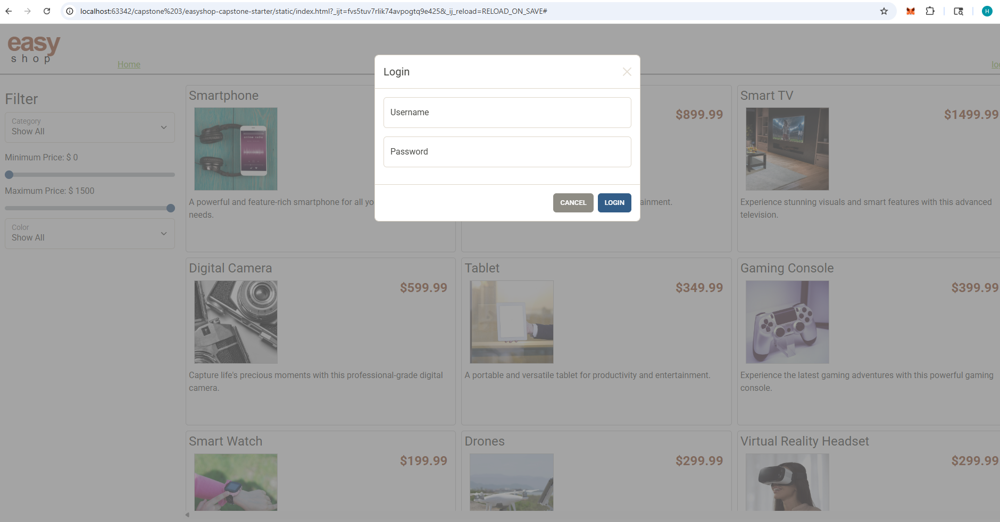

# EasyShop Capstone

A full-stack e-commerce application built with Spring Boot + MySQL and a multi-page HTML/CSS/JS frontend. Features product browsing, JWT authentication, role-based admin management, a shopping cart, user profiles, and a wishlist.

---

## Table of Contents
- [Overview](#overview)
- [Features](#features)
- [Architecture](#architecture)
- [Tech Stack](#tech-stack)
- [Screenshots](#screenshots)
- [API Endpoints](#api-endpoints)
- [Authentication](#authentication)
- [Database](#database)
- [Frontend](#frontend)
- [Setup](#setup)
- [Running](#running)
- [Testing](#testing)
- [Interesting Code](#interesting-code)
- [Tools & Libraries](#tools--libraries)
- [Project Structure](#project-structure)
- [Contributing](#contributing)
- [Roadmap](#roadmap)
- [Version & Changelog](#version--changelog)
- [License](#license)
- [Author](#author)
- [Acknowledgments](#acknowledgments)
- [Contact](#contact)

---

## Overview
EasyShop is a realistic micro-retail application:
- Secure login/register with JWT
- Public product browsing with category and price filters
- Role-based admin operations (create/update/delete products and categories) via an in-browser admin UI
- Authenticated shopping cart flow
- User profile management
- Wishlist for saving products

Logo:


---

## Features
- **Landing Page:** Dedicated entry page that routes guests and authenticated users appropriately.
- **Product Catalog:** Products displayed on the home screen; filter by category, price range, and subcategory. Image detail view available.
- **Authentication:** Username/password login with JWT; register new users with roles.
- **Authorization:** `ROLE_USER` and `ROLE_ADMIN` guards via Spring Security.
- **Shopping Cart:** Add, update quantity, remove products, and clear cart. Cart accessible via a header icon.
- **User Profile:** View and edit profile information; changes persist to the database.
- **Wishlist:** Save and manage a list of desired products.
- **Admin UI:** In-browser admin panel (`admin-products.html`, `admin-product-form.html`) for managing products without needing an API client.
- **REST API:** Clean controllers with validation and rich HTTP responses.
- **Reusable Frontend Components:** Shared `header.html` and `footer.html` included across pages.

---

## Architecture
- **Backend:** Spring Boot (Java 17), controllers → DAO → MySQL via JDBC.
- **Security:** Stateless JWT with custom filters and `@PreAuthorize` guards; HTTP security rules explicitly configured.
- **Data Access:** DAO implementations using JDBC; rows mapped into models.
- **Frontend:** Static HTML/CSS/JS files served by Spring, calling backend APIs via Axios. Pages share reusable header/footer template fragments.

---

## Tech Stack
- **Language:** Java 17
- **Frameworks:** Spring Boot, Spring Security, Spring Validation
- **Auth:** JWT (`io.jsonwebtoken` JJWT)
- **Database:** MySQL 8, JDBC (`spring-jdbc`)
- **Build:** Maven Wrapper
- **Frontend:** HTML5, CSS, Bootstrap, Axios, vanilla JS
- **Testing:** JUnit, Spring Boot Test, Spring Security Test
- **Dev Experience:** Spring Boot DevTools, Insomnia for API testing, VS Code

See [pom.xml](pom.xml) for full dependency list.

---

## Screenshots
User-facing and API testing views:

- Home page:

  

- Cart page:

  

- Login:

  

- Register (Insomnia):

  

---

## API Endpoints
Public and protected routes (selected):

- **Products**
  - `GET /products` — search with optional `cat`, `minPrice`, `maxPrice`, `subCategory`
  - `GET /products/{id}` — get a product
  - `POST /products` — create (admin)
  - `PUT /products/{id}` — update (admin)
  - `DELETE /products/{id}` — delete (admin)

- **Categories**
  - `GET /categories` — list all
  - `GET /categories/{id}` — get by id
  - `GET /categories/{id}/products` — products in a category
  - `POST /categories` — create (admin)
  - `PUT /categories/{id}` — update (admin)
  - `DELETE /categories/{id}` — delete (admin)

- **Shopping Cart** (authenticated)
  - `GET /cart` — get current user's cart
  - `POST /cart/products/{productId}` — add product
  - `PUT /cart/products/{productId}` — update quantity
  - `DELETE /cart` — clear cart
  - `DELETE /cart/products/{productId}` — remove product

- **Profile** (authenticated)
  - `GET /profile` — get current user's profile
  - `PUT /profile` — update current user's profile

- **Wishlist** (authenticated)
  - `GET /wishlist` — get current user's wishlist
  - `POST /wishlist/products/{productId}` — add product to wishlist
  - `DELETE /wishlist/products/{productId}` — remove product from wishlist

- **Auth**
  - `POST /login` — returns JWT + user in body
  - `POST /register` — creates user + profile

Controller sources:
- [ProductsController](src/main/java/org/yearup/controllers/ProductsController.java)
- [CategoriesController](src/main/java/org/yearup/controllers/CategoriesController.java)
- [ShoppingCartController](src/main/java/org/yearup/controllers/ShoppingCartController.java)
- [ProfileController](src/main/java/org/yearup/controllers/ProfileController.java)
- [WishlistController](src/main/java/org/yearup/controllers/WishlistController.java)
- [AuthenticationController](src/main/java/org/yearup/controllers/AuthenticationController.java)

---

## Authentication
- **Login:** `POST /login` with `{ "username": "...", "password": "..." }`.
- **JWT:** Token returned in body; send as `Authorization: Bearer <token>` on protected routes.
- **Roles:** `ROLE_USER` (default) and `ROLE_ADMIN`. Admins can manage products and categories.
- **Security Config:** See [WebSecurityConfig](src/main/java/org/yearup/security/WebSecurityConfig.java).

Insomnia example — updating a product (admin):
```
PUT http://localhost:8080/products/{id}
Authorization: Bearer <JWT>
Content-Type: application/json

{
  "name": "Updated Product Name",
  "price": 19.99,
  "categoryId": 2,
  "description": "Updated description",
  "subCategory": "accessories",
  "stock": 50,
  "featured": true,
  "imageUrl": "https://example.com/images/updated-product.jpg"
}
```

---

## Database
- **Schema & Seed:** Run [database/create_database_easyshop.sql](database/create_database_easyshop.sql).
- **Config:** Edit [src/main/resources/application.properties](src/main/resources/application.properties)
  - `datasource.url=jdbc:mysql://localhost:3306/easyshop`
  - `datasource.username=...`
  - `datasource.password=...`
  - `jwt.secret=...` (set your own secret!)
- DAO examples:
  - [MySqlProductDao](src/main/java/org/yearup/data/mysql/MySqlProductDao.java)
  - [MySqlProfileDao](src/main/java/org/yearup/data/mysql/MySqlProfileDao.java)
  - [MySqlShoppingCartDao](src/main/java/org/yearup/data/mysql/MySqlShoppingCartDao.java)
  - [MySqlWishlistDao](src/main/java/org/yearup/data/mysql/MySqlWishlistDao.java)

---

## Frontend
Static assets live under [src/main/resources/static](src/main/resources/static):
- HTML templates in [templates/](src/main/resources/static/templates)
- Styles in [css/](src/main/resources/static/css)
- JS services/utilities in [js/](src/main/resources/static/js) (Axios included)

Key pages:
| Template | Description |
|---|---|
| `home.html` | Product catalog with filters |
| `product.html` | Product detail / image view |
| `cart.html` | Shopping cart |
| `wishlist.html` | User wishlist |
| `profile.html` | User profile editor |
| `login-form.html` | Login |
| `admin-products.html` | Admin product list |
| `admin-product-form.html` | Admin create/edit product form |
| `header.html` / `footer.html` | Shared layout components |

Entry files:
- [static/index.html](src/main/resources/static/index.html)
- [static/js/application.js](src/main/resources/static/js/application.js)
- [static/js/services/](src/main/resources/static/js/services)

---

## Setup
1. Install **MySQL 8** and create the DB using the SQL script.
2. Update application settings in [application.properties](src/main/resources/application.properties).
3. Ensure Java 17 is available (`java -version`).

---

## Running
On Windows:

```powershell
# from project root
.\mvnw.cmd clean install
.\mvnw.cmd spring-boot:run
```

Then open `http://localhost:8080`.

---

## Testing
Run unit/integration tests:

```powershell
.\mvnw.cmd test
```

Test resources live in [src/test/resources](src/test/resources), including [test-data.sql](src/test/resources/test-data.sql).

---

## Interesting Code
A single prepared statement that supports optional filters for category, price range, and subcategory — no dynamic SQL string building:

```java
// src/main/java/org/yearup/data/mysql/MySqlProductDao.java
public List<Product> search(Integer categoryId, BigDecimal minPrice, BigDecimal maxPrice, String subCategory) {
    String sql = "SELECT * FROM products " +
        "WHERE (category_id = ? OR ? = -1) " +
        "  AND (price >= ? OR ? = -1) " +
        "  AND (price <= ? OR ? = -1) " +
        "  AND (LOWER(subcategory) = LOWER(?) OR ? = '') ";
}
```

Why it's neat:
- Keeps a single prepared statement while allowing any combination of filters.
- Avoids dynamic SQL string building; relies on sentinel defaults (`-1` / `''`).

---

## Tools & Libraries
- **Spring Boot** (Web, Security, Validation)
- **JWT (JJWT)** for stateless auth
- **Spring JDBC** for database access
- **MySQL Connector/J**, **Commons DBCP2** for connection pooling
- **Maven Wrapper** for builds
- **Bootstrap**, **Axios**, **Vanilla JS** on the frontend
- **Spring Boot DevTools** for faster local iteration
- **JUnit + Spring Test** for tests
- **Insomnia** for endpoint verification
- **VS Code** as the primary editor

---

## Project Structure
```
.
├── mvnw / mvnw.cmd
├── pom.xml
├── database/
│   └── create_database_easyshop.sql
├── src/
│   ├── main/
│   │   ├── java/org/yearup/
│   │   │   ├── controllers/   (Products, Categories, Cart, Profile, Wishlist, Auth)
│   │   │   ├── data/mysql/    (DAO implementations)
│   │   │   ├── models/        (Product, Category, ShoppingCart, Profile, Wishlist, User, ...)
│   │   │   └── security/      (JWT filters, WebSecurityConfig, ...)
│   │   └── resources/
│   │       ├── application.properties
│   │       └── static/
│   │           ├── index.html
│   │           ├── css/
│   │           ├── js/
│   │           ├── images/
│   │           └── templates/ (landing, home, product, cart, wishlist, profile, admin, ...)
│   └── test/
│       ├── java/org/yearup/
│       └── resources/ (test-data.sql)
└── screenshots/
```

---

## Contributing
Pull requests are welcome. For major changes, please open an issue first to discuss what you'd like to change. Keep changes focused and follow existing style. Add tests where practical.

---

## Roadmap
- Product reviews and ratings
- Pagination and sorting for catalog
- Order history
- Docker Compose for local DB + app

---

## Version & Changelog
- Current version: 0.0.1-SNAPSHOT (see [pom.xml](pom.xml))
- Track changes via git commits.

---

## Author
- Henok
- YearUp Capstone Project

---

## Acknowledgments
- YearUp curriculum and guidance
- Pluralsight resources for Java/Spring
- Spring Boot and open-source community

---

## Contact
- Email: henoksmekuria@gmail.com
- Issues and feature requests: open an issue in this repository
